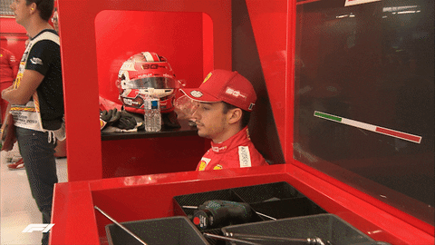

<h1 style="text-align:center;"> Hi, I'm Abdellah! 👋</h1>

Aspiring software developer passionate about creating impactful solutions through code.

## 📫 Connect with Me

- [LinkedIn](https://www.linkedin.com/in/abdellah-ahmed-abdullahi-b229382a2)
- [Twitter](https://x.com/HimoNotting)

## 🚀 About Me

- 🌱 I’m currently learning **TypeScript** and **backend development**.
- 💬 Ask me about **Flutter**, **Next.js**, and **Python**.
- ⚡ Fun fact: I love exploring new technologies and applying them to real-world projects.

## 🛠️ Skills

- **Languages**:   
- **Frameworks**:   
- **Tools**:   

